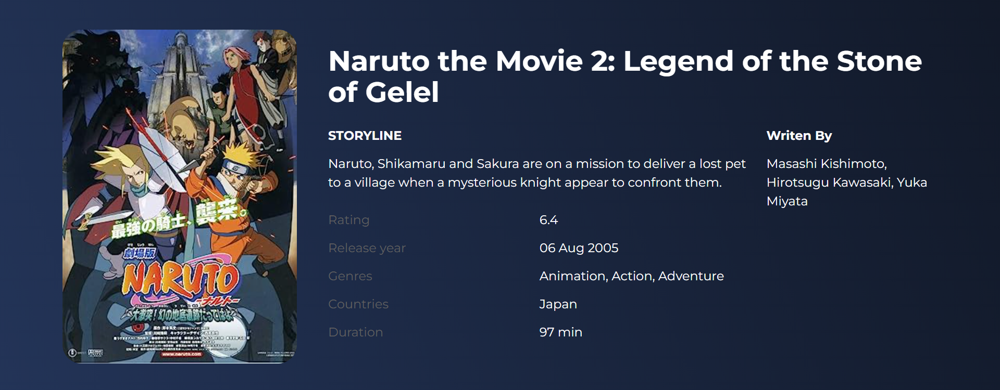

# MovieDB

## Overview
This is a web application that utilizes the OMDBAPI to fetch movie data and displays it using a UI designed in Figma.

## Features
- Search for movies by title
- View detailed information about a specific movie
- Display movie posters and additional details

## Technologies Used
- HTML
- CSS
- JavaScript
- React
- TailwindCSS
- OMDBAPI
- Figma

## Usage
1. Clone the repository: `git clone https://github.com/your-username/repository.git`
2. Navigate to the project directory: `cd repository`
3. Open the `index.html` file in your preferred web browser.

## Configuration
To use the OMDBAPI, you will need to obtain an API key. Follow these steps to configure the application:

1. Visit the OMDBAPI website: [https://www.omdbapi.com/](https://www.omdbapi.com/)
2. Sign up for an account and obtain an API key.
3. Open the `script.js` file.
4. Replace `'YOUR_API_KEY'` with your actual API key in the following line: 
   ```javascript
   const apiKey = 'YOUR_API_KEY';

## Design
The user interface of this web application was designed using Figma. You can view the UI design by accessing the following link: [Figma UI Design](https://www.figma.com/community/file/1205860363512453151/Movies.io)

## Credits
- [OMDBAPI](https://www.omdbapi.com/)

## License
This project is licensed under the [MIT License](LICENSE).
